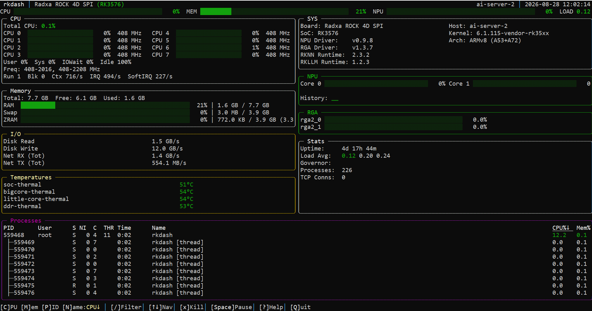

# rkdash

A terminal-based system monitor for Rockchip single-board computers (RK3566, RK3576, RK3588 and variants), built with Go and [tcell](https://github.com/gdamore/tcell). It's an `htop`/`btop`-style dashboard that additionally surfaces Rockchip-specific hardware: GPU, NPU, and RGA utilization, per-cluster CPU frequency ranges, thermal zones, and driver/SDK version info.

This is a Go port of [rktop](https://github.com/ajokela/rktop) by Alex Jokela, originally written in Rust with [Ratatui](https://ratatui.rs/). Panel layout, keybindings, and data sources mirror the original; this port reimplements them in Go with tcell instead of Ratatui/crossterm.



## Features

- **CPU** — per-core usage, aggregate user/system/iowait/idle breakdown, frequency ranges per cluster, governor, context switch/interrupt/softirq rates, running/blocked process counts, load average
- **Memory** — total/used/available RAM, swap, and ZRAM compression stats; the RAM bar breaks out reclaimable page cache/buffers in a distinct color from true "used"
- **GPU / NPU / RGA** — Mali GPU utilization and frequency, RKNPU per-core load and frequency, RGA per-scheduler load, with sparkline history for GPU/NPU
- **Disk & Network I/O** — aggregate read/write throughput across physical disks, per-adapter RX/TX rates with IP addresses
- **Temperatures** — all thermal zones plus GPU temperature via hwmon
- **Board info** — board model, detected Rockchip SoC, CPU architecture/core mix, NPU/RGA driver versions, librknnrt/librkllmrt SDK versions
- **Process table** — sortable by CPU, memory, PID, or name; live filter by name/user; SIGTERM a selected process with a confirmation prompt
- **Power / throttling** — per-cluster cpufreq caps with an explicit warning when the kernel has capped a cluster below its hardware ceiling, active cooling-device states, fan RPM and rail power from hwmon
- **Accelerator ownership** — a badge column showing which processes hold `/dev/rknpu`, `/dev/mpp_service`, `/dev/rga`, `/dev/mali0` and friends open, plus a filter to show only those processes
- **Per-process detail** — command line, exe, cwd, RSS/VSZ, fd count, cumulative disk I/O, accelerator handles, and per-process CPU/memory history
- **History graphs** — gradient-coloured traces for CPU, memory, GPU, NPU, VPU, RGA, network and disk
- **Configurable** — `~/.config/rkdash/rkdash.conf` for refresh rates, hidden panels, sort order and colour mode; panels toggle live with the number keys
- **Scriptable** — `--json` for a one-shot snapshot, `--csv` to record a benchmark run, `--mcp` for agent access
- **Live controls** — pause/resume data refresh, mouse support, resize-aware layout

## Requirements

- A Rockchip-based Linux board (RK3566/RK3576/RK3588 families); some panels degrade gracefully (e.g. "Not Detected") on other hardware
- Root privileges at runtime (reads root-only debugfs paths such as `/sys/kernel/debug/mali0` and `/sys/kernel/debug/rknpu`)
- Go 1.26+ to build

## Installing

Grab the prebuilt `linux/arm64` binary from the
[latest release](https://github.com/anand34577/rkdash/releases/latest):

```sh
curl -LO https://github.com/anand34577/rkdash/releases/latest/download/rkdash-linux-arm64
curl -LO https://github.com/anand34577/rkdash/releases/latest/download/rkdash-linux-arm64.sha256
sha256sum -c rkdash-linux-arm64.sha256
chmod +x rkdash-linux-arm64 && sudo ./rkdash-linux-arm64
```

## Building

### From the target board (or any Linux/arm64 host)

```sh
go build -o rkdash .
```

### Cross-compiling from Windows

Two equivalent helper scripts are provided; both cross-compile for `linux/arm64` and place the binary in `dist/`:

```bat
build-linux-arm64.bat
```

```powershell
./build-linux-arm64.ps1
```

Copy the resulting binary to the board and run it:

```sh
chmod +x rkdash-linux-arm64
sudo ./rkdash-linux-arm64
```

## Usage

```sh
sudo rkdash
```

### MCP server mode

Running with `--mcp` skips the TUI entirely and serves rkdash's readers as an [MCP](https://modelcontextprotocol.io) server over stdio, so an MCP client (an agent, an IDE) can query board telemetry:

```sh
rkdash --mcp
```

Tools exposed: `system_snapshot` (CPU/memory/swap/ZRAM/load/uptime), `hardware_info` (board identity, GPU/NPU utilization and frequency, thermal zones), `top_processes` (sorted by CPU or memory). Root is not required to start this mode, but debugfs-gated readings (GPU/NPU) will report as unavailable without it, same as the TUI.

### Scripting modes

```sh
# One-shot JSON snapshot (add --json-procs N to include the top N processes)
rkdash --json

# Record a benchmark run to CSV while the TUI is up
sudo rkdash --csv /tmp/rknn-bench.csv
```

`--json` emits system, hardware, VPU/RGA load, throttling, cooling and per-device disk counters in one document. `--csv` appends a row on every CPU refresh with CPU/mem/GPU/NPU, load, network and disk rates, a throttled flag, every thermal zone, and every VPU/RGA block — flushed each sample, so a Ctrl-C'd run still leaves a complete file.

| Key         | Action                                             |
|-------------|-----------------------------------------------------|
| `↑` / `↓`   | Move process selection (list scrolls to follow)      |
| `PgUp`/`PgDn` | Move selection by 10                              |
| `Enter`     | Open/close the detail pane for the selected process |
| `a` / `A`   | Show only processes holding an NPU/VPU/RGA/GPU device |
| `b` / `B`   | Toggle the accelerator badge column                 |
| `1`..`9`, `0` | Toggle a panel (cpu, memory, io, temps, power, sys, gpu, npu, rga, vpu) |
| `S`         | Save the current panels/sort to the config file     |
| `/`         | Filter processes by name/user (Enter confirms, Esc clears) |
| `c` / `C`   | Sort by CPU (toggles ascending/descending)          |
| `m` / `M`   | Sort by memory (toggles ascending/descending)       |
| `p` / `P`   | Sort by PID (toggles ascending/descending)          |
| `n` / `N`   | Sort by name (toggles ascending/descending)         |
| `x` / `X`   | Kill selected process (press `y`/`Y` to confirm SIGTERM) |
| `Space`     | Pause/resume data refresh                           |
| `?`         | Toggle help overlay                                 |
| `q` / `Q`   | Quit                                                |

## Project layout

| File               | Responsibility                                                        |
|--------------------|------------------------------------------------------------------------|
| `main.go`          | Entry point, event loop, refresh scheduling, key handling             |
| `app.go`           | `AppState` — UI/runtime state and derived stats updated each tick     |
| `sysmon.go`        | Core system stats: CPU jiffies, memory, ZRAM, disk I/O, network, load |
| `hardware.go`      | Rockchip/board-specific hardware: GPU/NPU/RGA, thermal, board identity|
| `procs.go`         | Process/thread enumeration, CPU%/mem% computation, sorting            |
| `proccontrol.go`   | Process termination (SIGTERM)                                         |
| `filecache.go`     | Cached file descriptors for frequently-polled sysfs/debugfs paths     |
| `canvas.go`        | Small terminal-layout/rendering primitives (rects, spans, splitting)  |
| `ui.go`            | Panel rendering: header, CPU/memory/accelerator/I/O panels, process table, help overlay |
| `config.go`        | Config file load/save, panel visibility, colour-mode detection        |
| `accel.go`         | Accelerator device ownership, cpufreq throttling, cooling, per-disk I/O |
| `detail.go`        | Per-process detail pane and its `/proc/<pid>` readers                 |
| `export.go`        | `--json` snapshot and `--csv` recorder                                |
| `mcpserver.go`     | MCP server mode (`--mcp`): exposes system/hardware readers as MCP tools over stdio |

## Configuration

Settings live in `$XDG_CONFIG_HOME/rkdash/rkdash.conf` (or `$HOME/.config/rkdash/rkdash.conf`). Override the path with `--config` or `$RKDASH_CONFIG`.

Note that rkdash runs under `sudo`, so `$HOME` is usually root's — set `RKDASH_CONFIG` if you want the file somewhere else. Press `S` in the TUI to write the current panel layout and sort order back to it.

```ini
refresh_cpu_ms  = 1000
refresh_io_ms   = 2000
refresh_proc_ms = 2000

# Panels toggled off, comma-separated
hidden = vpu,rga

sort = cpu          # cpu, mem, pid, name
truecolor = auto    # auto (trust $COLORTERM), on, off
accel_only = false  # start filtered to accelerator users
badges = true       # accelerator badge column (costs an fd walk per refresh)
```

If the UI renders as a single flat colour, your terminal isn't advertising 24-bit colour. Check `echo $COLORTERM`; set `truecolor = off` to get a readable 8-colour palette instead of a muddy gradient.

The terminal itself is polled every 250ms for input and resize responsiveness independent of these data refresh intervals.

The terminal itself is polled every 250ms for input and resize responsiveness independent of these data refresh intervals.

## Developer tooling

`tools/stripcomments` is a small Go-AST-based utility used to strip all comments from the top-level `*.go` files in this repository without altering behavior — it parses each file with `go/parser`, drops all comment nodes, and re-emits the source with `go/format`, which guarantees the result still parses and compiles.

```sh
# Preview which files would change
go run ./tools/stripcomments -dir .

# Apply the changes
go run ./tools/stripcomments -dir . -write
```

It only touches `*.go` files directly inside the given `-dir` (non-recursive) and skips `_test.go` files.

## License

BSD 3-Clause, inherited from the upstream [rktop](https://github.com/ajokela/rktop) project (Copyright (c) 2025, Alex Jokela and contributors). See [LICENSE](LICENSE).
